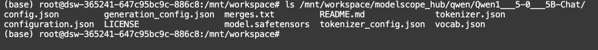

# Mini-LIMA Assignment
In this assignment, you will need to complete:
1. instruction dataset construction
2. model alignment via supervised fine-tuning(sft)
3. model evaluation


## Environment Setup:

### Conda Environment Setup
Suppose you are using ModelScope and DSW notebook.
Please follow the scripts below
```bash
cd /mnt/workspace
conda activate base

## clone llama-factory as sft codebase
git clone https://github.com/hiyouga/LLaMA-Factory.git
cd LLaMA-Factory/
pip install -r requirements.txt
cd ..

## directly install alpaca eval as evaluation codebase
git clone https://github.com/tatsu-lab/alpaca_eval.git
cd alpaca_eval/
pip install -e .
cd ..

# install specific sklearn version
pip install scikit-learn==1.4.0
```

### OpenRouter API Key

If you want to use models hosted on OpenRouter, you should sign in and obtain your own API key. 

Register your account on [OpenRouter Website](https://openrouter.ai) and get your API key on [this page](https://openrouter.ai/keys).

#### Usage
you can directly set your environment variables via:

```bash
# if you are using OpenAI
export OPENAI_API_BASE=<YOUR_OPENAI_API_BASE>
export OPENAI_API_KEY=<YOUR_OPENROUTER_API_KEY>

# if you are using OpenRouter
export OPENAI_API_BASE=https://openrouter.ai/api/v1
export OPENAI_API_KEY=<YOUR_OPENROUTER_API_KEY>
export OPENROUTER_API_KEY=<YOUR_OPENROUTER_API_KEY>
```

or you can set it in Python via:
```python
openai.api_base = "https://openrouter.ai/api/v1"
openai.api_key = OPENROUTER_API_KEY
```

**Note**: DSW will only save `ipynb` files after shutting down. So you should better save previous scripts in a notebook. We have already provided an example in `run.ipynb` for your reference.

**API Rate Limitation**:
- Free version of Mistral API has rate limit of `10 req/min`. All you can do is wait.
- You can also try: [Groq](https://console.groq.com/docs/models) to get free model access; it is also "openai-compatible"; and have rate limit of `30 req/min` for `Mixtral-8x7B`.

## Assignment Details


### Instruction Data Construction

The seed data is already given in [this file](./seed_data/seed_tasks.jsonl). You can utilize existing powerful LLMs to generate high-quality instruction data which shall contain multiple turns of user and assistant interaction.


### Supervised Fine-tuning

As mentioned, you are recommended to use [Qwen 1.5](https://github.com/QwenLM/Qwen1.5) model series (especially, 0.5B and 1.8B).
You should perform sft over your generated data rather than any other open-sourced dataset.

You can directly utilize off-the-shelf tuning codebase, such as [LLaMA-Factory](https://github.com/hiyouga/LLaMA-Factory).

#### Download Base Model

You can easily download the base model via `ModelScope`:

For instance, you can first set:
```bash
export MODELSCOPE_CACHE=/mnt/workspace/modelscope_hub
```

```python
from modelscope.models import Model
model = Model.from_pretrained('qwen/Qwen1.5-0.5B')
```

you can check the files downloaded at the cache dir:
```bash
ls /mnt/workspace/modelscope_hub/qwen/Qwen1___5-0___5B
```

and you should find files like:


**Note**: it is OK if you meet some warning or error. Just make sure the file is properly downloaded.

#### Supervised Fine-tuning Scripts

A very simple run script is given in [this folder](./finetune/). Try:

```bash
bash finetune/run.sh
```

**Note**: you should preprocess your datasets to make them feasible for LLaMA Factory and copy the data to LLaMA Factory dataset folder. For more info, please check its [README](https://github.com/hiyouga/LLaMA-Factory/blob/main/data/README.md).

### Model Evaluation

Finally, you should evaluate the model's performance on [AlpacaEval](https://github.com/tatsu-lab/alpaca_eval).

You should report your score on **chatgpt evaluators**:

Example usage:
```bash
# use HF mirror endpoint so that you can access the datasets properly on DSW notebook.
export HF_ENDPOINT=https://hf-mirror.com

# copy your model config into alpaca folder
cp -r mini_lima/ alpaca_eval/src/alpaca_eval/models_configs/

alpaca_eval evaluate_from_model \
  --model_configs 'mini_lima' \
  --annotators_config 'chatgpt'
```

Hopefully you can get a csv showing the performance.

### Report Template

We encourage you to use $\LaTeX$ to generate your report pdf file. A reference template is available [here](https://www.overleaf.com/read/crtcwgxzjskr#7213b2).


## Acknowledgement
This assignment is based on the awesome [LLaMAFactory](https://github.com/hiyouga/LLaMA-Factory) and [AlpacaEval](https://github.com/tatsu-lab/alpaca_eval). We thank the authors and maintainers for their great contributions to LLM alignment.